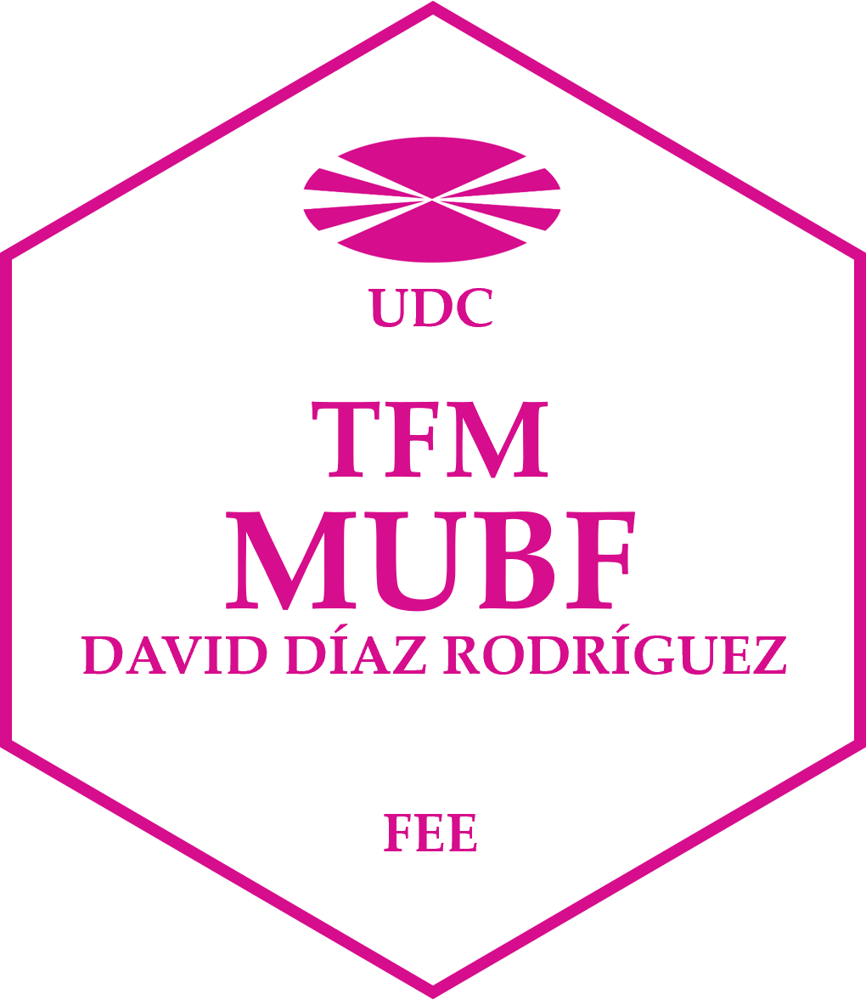

# Español

## Aplicación de redes neuronales artificiales y programación cuadrática en la gestión de carteras

 Este repositorio contiene el código fuente del sitio web de la presentación del Trabajo de Fin de Máster **"Aplicación de redes neuronales artificiales y programación cuadrática en la gestión de carteras"** de David Díaz Rodríguez y tutelado por Xosé Manuel Martínez Filgueira. El sitio está construido usando [Quarto](https://quarto.org/).

# English

## Application of artificial neural networks and quadratic programming in portfolio management

This repository contains the source code of the website of the presentation of the Master's Thesis **"Application of artificial neural networks and quadratic programming in portfolio management"** by David Díaz Rodríguez and supervised by Xosé Manuel Martínez Filgueira. The site is built using [Quarto](https://quarto.org/).

# Galego

## Aplicación das redes neuronais artificiais e da programación cuadrática na xestión de carteiras

Este repositorio contén o código fonte da páxina web para a presentación do Traballo Fin de Máster **"Aplicación das redes neuronais artificiais e da programación cuadrática na xestión de carteiras"** de David Díaz Rodríguez e dirixida por Xosé Manuel Martínez Filgueira. O sitio está construído usando [Quarto](https://quarto.org/).

# Paquetes

|Paquete        |Versión|
|---------------|-------|
|readr          |2.1.4  |
|dplyr          |1.1.2  |
|plotly         |4.10.2 |